# Toolchain for Generating Right Leaning Identity Tangle Trees

[](https://doi.org/10.5281/zenodo.17612686)
[](https://www.gnu.org/licenses/gpl-3.0)

## Note to Reader

If you discover an issue with this repository or have a question, please feel free to open an issue.
I've included templates for the following issues:

- 🖋️ Spelling and Grammar: Found some language that is incorrect?
- 🤷 Clarity: Found a section that just makes no sense?
- ❓ Question: Do you have a general question?
- 🐞 Bug: Found an error in the code?
- 🚀 Enhancement: Have a suggestion for making the toolchain better?

## Cite Me 📃

BibTeX and APA on the right sidebar of GitHub.

## License ⚖️

GNU GPL v3

## Run the toolchain

Before running the toolchain ensure that you are running Linux and have the following installed:

1. [Rootless Docker](https://docs.docker.com/engine/security/rootless/)
2. [Just](https://github.com/casey/just)
3. [Git](https://git-scm.com/)
    - And clone the repository
4. [CMake](https://cmake.org/)
5. [uv](https://docs.astral.sh/uv/)
6. [GCC (or another c compiler, this should already be the case on Linux)](https://gcc.gnu.org/)
7. [MongoDB Compass (optional for viewing database)](https://www.mongodb.com/products/tools/compass)

Run the following command:

```sh
just go
```

This will run the following tasks:

1. Bootstrap the environment:
    1. Pull submodules
    2. Create a .venv
    3. Install requirements into .venv
2. Build documents
3. Build cython wrapper libraries
4. Build docker containers
5. Run docker compose playbook

## Planning and Administration

### Tasks

Tasks are tracked as GitHub issues, each `Enhancement` and `Bug` generating the following collection
of issues and child issues:

- A primary issue describing the goal.
- A documentation child issue.
- An implementation child issue.
- A validation child issue.

### Version control

The generator toolchain shall be kept under Git versioning. Development shall take place on branches
with `main` on GitHub as a source of truth. GitHub pull requests shall serve as the arbiter for
inclusion on main with the following quality gates:

- Compiling of source code.
- Running of and passing unit test suite.
- Running of and passing linting and style enforcers.
- Successful generation of documentation.

#### Release Tagging

The project shall be tagged when an `Enhancement` or `Bug` issue is merged into main. The tag shall
follow [semantic versioning](https://semver.org) for labels.

```
vMAJOR.MINOR.PATCH
```

### Project Structure

```

 .
├──  docker
│   ├──  prometheus_reporting
│   │   ├──  Dockerfile
│   │   └──  prometheus.yml
│   ├──  docker-compose.yaml
│   └──  Dockerfile
├──  docs
│   └── 󰂺 README.md
├──  libraries
│   ├──  core_lib
│   └──  wrapper
│       ├──  CMakeLists.txt
│       └──  py_gen_RLITT.pyx
├──  misc
│   ├──  special_RLITT_no_parents.json
│   └──  stencils.json
├──  runner
│   ├──  fproducer
│   │   ├──  __init__.py
│   │   └──  fproducer.py
│   ├──  fworker
│   │   ├──  __init__.py
│   │   └──  fworker.py
│   ├──  lib_wrapper
│   │   ├──  __init__.py
│   │   └──  lib_wrapper.py
│   ├──  __init__.py
│   ├──  __main__.py
│   ├──  config_store.py
│   └──  odm.py
├── 󰡯 CITATION
├──  CMakeLists.txt
├──  flake.lock
├──  flake.nix
├──  Justfile
├──  LICENSE
├──  mkdocs.yml
├──  requirements.txt
└──  ruff.toml

```

#### Directories of interest

- Runner: This directory contains the python modules defining producers and workers for Faktory.
- Docs: This directory contains the documentation for the toolchain.
- Docker: This directory contains the dockerfiles and docker compose playbooks for the toolchain.
- Libraries: This directory contains a git submodule copy of the Core Libraries.

### Define a unit

A unit in this project shall be defined as a python module.

### Quality

The toolchain shall fail safe, that is the toolchain can fail but the failure must be detectable.

#### Unit testing

Each python module shall be unit tested.

#### Integration testing

Integration testing shall be carried out by a bench test of the Docker compose playbook.

<!-- prettier-ignore-start -->
!!! test-card "Integration Test"
   
    The toolchain is integrated into a docker compose playbook. The playbook is executed generating
    up to 8 crossing tangles. The correct tangles are generated by the toolchain. 

    **Inputs:**

    - A integrated docker compose playbook.

    **Expected Output:**

    - All tangles up to 8 crossings.
<!-- prettier-ignore-end -->

### Requirements

#### Functional Requirements

##### General Distributed Architecture

A full theoretical expansion of the generation of right leaning identity tangle trees (arborescent
tangles) can be found in the thesis by Starr (@@@TODO Add DOI when available).

We assume we begin with a collection of both horizontal and vertical integral tangles.

To distribute the generation of arborescent tangles we must define:

- The shape of a discrete generation job.
- A mechanism for queueing those jobs.
- A mechanism for maintaining and serving a queue of jobs.

As described in Starr, each RLITT (right leaning identity tangle tree, a class of arborescent
tangle) can be generated by a grafting operation between a rootstock and a scion (two smaller by
crossing number arborescent tangles). We note that the crossing number of these smaller trees sums
to the crossing number of the tree resulting from grafting. Each discrete job for generation
contains two collections of tangles, a collection of rootstocks and a collection of scions.
Programmatically these collections correspond to pages in a table of RLITT, meaning a job in the
queue is represented by the following data:

- A pointer to the start of a page of rootstocks.
- The crossing number of the rootstocks.
- A pointer to the start of a page of scions.
- The crossing number of the scions.
- The size of a page.

We note that to generate tangles of crossing number $n$, the full collection of tangles with
crossing number less than $n$ must be available. To fill a queue will jobs we produce a collection
of job stencils, described by all possible ordered integer pairs $(j,k)$ with $0\leq j<n$ and
$1<k<n$. These stencils shall be stored in a collection in the same MongoDB database as the tangles.
This will allow us to recover if an error occurs or power is lost. The generation of jobs from
stencils follows the following state machine:


The serving and maintenance of a distributed job queue is a solved problem with a number of
off-the-shelf products available. We shall adopt the
[Faktory](https://github.com/contribsys/faktory) system in this toolchain.

##### Use Cases

Functional requirements for the toolchain are phrased as use cases which can be seen in the sidebar.
The following use case diagram models the interdependence of those use cases.

```mermaid

flowchart LR
  aS["👤 Start Up"]
  subgraph Faktory
    aQ["👤 Empty Job Queue"]
    aJ["👤 Job Recieved"]
  end
  SUR(["Verify Stencil Collection State"])
  LH(["Load Job Queue"])
  MS(["Mark Stencil Complete"])
  PG(["Pageinate Collection"])
  MC(["Mark Stencil Configuration"])
  RP(["Retrieve Page"])
  GP(["Graft Pages"])
  GZ(["Graft Ungood Trees"])
  PJ(["Process Job"])
  UC(["Insert Tangle Into Collection"])
    aQ --> LH
    LH -. include .-> MS
    LH -. include .-> PG
    LH -. include .-> MC
    aS --> SUR
    SUR -. include .-> LH
    aJ --> PJ
    PJ -. include .->  RP
    PJ -. include .->  GP
    PJ -. include .->  GZ
    PJ -. include .->  UC
```



- [Verify Stencil Collection State](./use-cases/verify_stencil_collection_state.md)
- [Load Job Queue](./use-cases/load_job_queue.md)
- [Mark Stencil Complete](./use-cases/mark_stencil_complete.md)
- [Paginate Collection](./use-cases/pageinate_collection.md)
- [Mark Stencil Configuration](./use-cases/mark_stencil_configuration.md)
- [Process Job](./use-cases/process_job.md)
- [Retrieve Page](./use-cases/retrieve_page.md)
- [Graft Pages](./use-cases/graft_pages.md)
- [Graft Ungood Trees](./use-cases/graft_ungood_trees.md)
- [Insert Tangle Into Collection](./use-cases/insert_tangle_into_collection.md)

#### Non-Functional Requirements

<!-- prettier-ignore-start -->
!!! requirement-card "Two click deployment"
    The toolchain shall be deployable with as few clicks as possible. 
<!-- prettier-ignore-end -->

### Technologies

#### Languages/Frameworks

- Python
- pyfaktory
- cython

##### Style Guide

The python portions of the toolchain shall adhere to the configured ruff format and check settings.

#### Tools

- ruff
- uv
- nix
- mkdocs
- docker
- cmake
- docker compose
- Faktory
- prometheus

## Design and Documentation

### System

The following block diagram describes the python portion of the toolchain. Full unit descriptions
are found in the sidebar.


### Units

- [Typer Entry point](./unit-descriptions/entrypoint.md)
- [Configuration Handler](./unit-descriptions/config.md)
- [Faktory Worker](./unit-descriptions/worker.md)
- [Faktory Producer](./unit-descriptions/producer.md)
- [Cython Wrapper](./unit-descriptions/wrapper.md)
- [MongoDB ODM](./unit-descriptions/odm.md)
