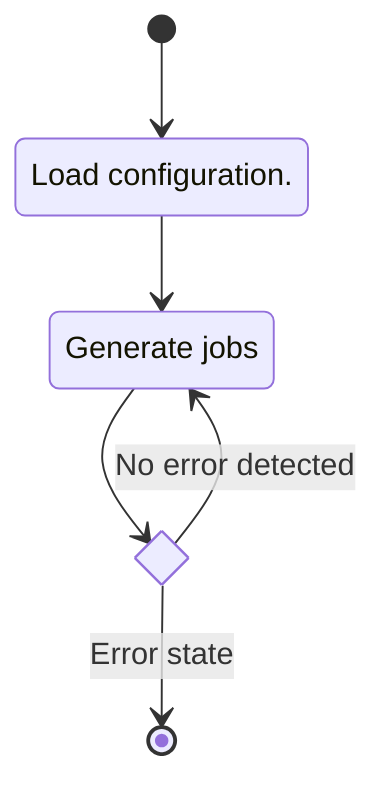
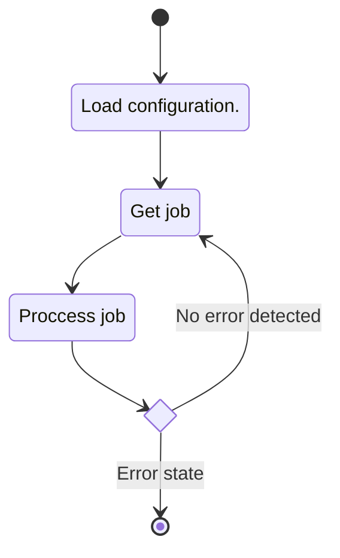

# Typer Entry Point

## Description

An entry point for the python portion of the RLITT generator toolchain. The entry point exposes a
command line interface utilizing the [Typer](https://typer.tiangolo.com/) library. Two interfaces
are offered, one that starts the tool in producer mode and that starts the tool in worker mode.

### Public Interfaces

#### Producer Mode

In producer mode the tool generates and enqueues new jobs.

##### State machine

#### Worker Mode

The worker mode for the tool subscribes to and

##### State machine

## Unit test description

## Implementation

<!-- prettier-ignore-start -->
::: runner.__main__
    :docstring: 
    :members:

<!-- prettier-ignore-end -->
