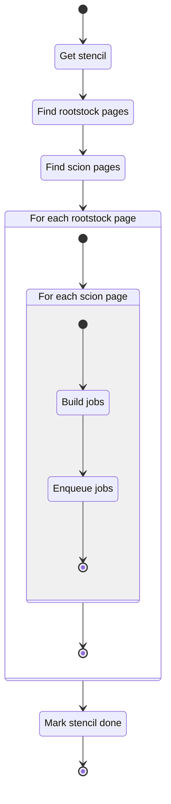

# Producer Mode

## Description

This unit describes the functionality for the producer mode. When running we expect a single
instance of the producer to run.

### Public Interfaces

#### Faktory Producer

The Faktory producer interface serves as the primary entry point for producer mode. The interface
implements the job production state machine found in the README.

### Private interface

#### Process Stencil

Stencils consist of an ordered pair $(j,k)$, with $j+k=\text{TCN}$ the target TCN (tree crossing
number). The stencils are used to produce jobs (job structure as described in the README) by
pagination of an input collection of tangles.

##### State machine

## Unit test description

### Process Stencil

We will unit test the `_process_stencil` function but skip other interfaces due to lack of mock
tooling.

#### Positive Tests

<!-- prettier-ignore-start -->
!!! test-card "Valid Stencil"
   
    A valid stencil and collection is configured. Correct output jobs are created.

    **Inputs:**

    - Mocked MongoDB collection
    - Page size set to two
 
    **Expected Output:**

    - Jobs generated 
<!-- prettier-ignore-end -->

#### Negative tests

<

<!-- prettier-ignore-start -->
!!! test-card "Empty collection "
  
    An empty collection is configured.  

    **Inputs:**

    - Mocked empty MongoDB collection

    **Expected Output:**
    
    - Exception is thrown 
<!-- prettier-ignore-end -->

<!-- prettier-ignore-start -->
## Implementation

<!-- prettier-ignore-start -->
::: runner.fproducer.fproducer
    :docstring: 
    :members:

<!-- prettier-ignore-end -->
