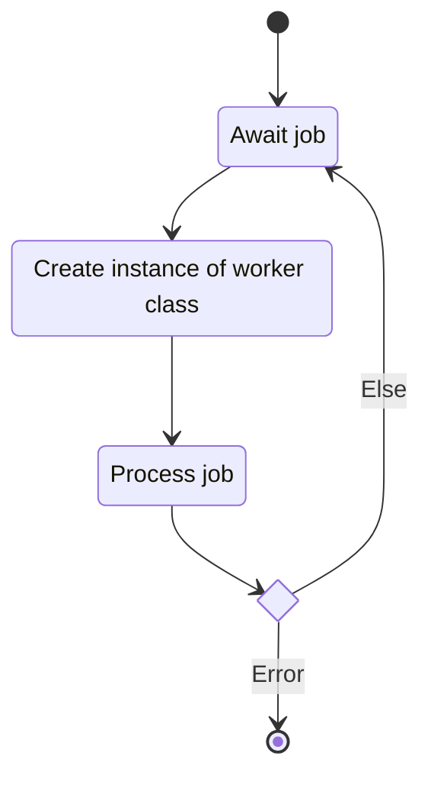
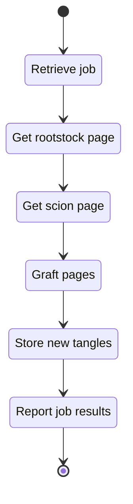

# Worker Mode

## Description

This unit describes the functionality for the system's worker mode. When running we expect $n$
instances of the worker to run simultaneously.

### Public Interfaces

#### Faktory Job

The Faktory worker interface serves as the primary entry point for worker mode. The interface
retrieves and processes tangle generation jobs distributed by Faktory.

##### State Machine

### Private interface

#### Class Worker

The worker class describes the data and methods needed for an atomic generation job.

##### Process Job

The process job method contains the core logic of the worker class. The method connects to the
MongoDB tangle collection and retrieves the pages pointed to by the job data. The method then calls
the low-level grafting code to generate the new tangles from the pages.

###### State Machine

## Unit test description

### Process Job

#### Positive Tests

<!-- prettier-ignore-start -->
!!! test-card "Valid job"
   
    A valid job and collection is configured. Job processing is started. Correct output tangles are written.

    **Inputs:**

    - Mocked MongoDB collection
    - Page size set to two

    **Expected Output:**

    - Tangles correctly generated
    - Each tangle is seen in a page. 
<!-- prettier-ignore-end -->

#### Negative tests

<!-- prettier-ignore-start -->
!!! test-card "Invalid collection"
   
    An invalid collection is configured. 
    **Inputs:**

    - Mocked invalid MongoDB collection

    **Expected Output:**
    
    - Exception is thrown 
<!-- prettier-ignore-end -->

<!-- prettier-ignore-start -->
!!! test-card "Invalid Index"
  
    A page index is found in the job but not found in the collection. 

    **Inputs:**

    - Mocked valid MongoDB collection
    - Invalid index

    **Expected Output:**
    
    - Exception is thrown 
<!-- prettier-ignore-end -->

## Implementation

<!-- prettier-ignore-start -->
::: runner.fworker.fworker
    :docstring: 
    :members:

<!-- prettier-ignore-end -->
